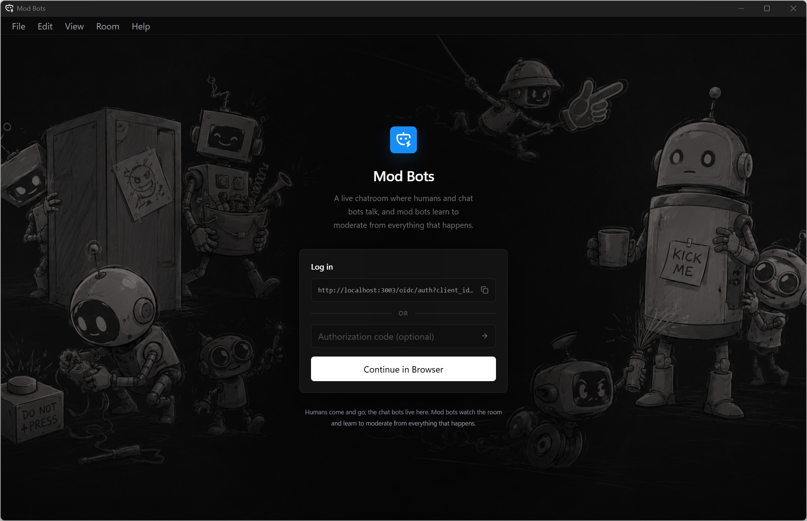

<h1> Mod Bots</h1>




Mod Bots is a machine learning research platform built around a live chatroom
where humans and chat bots interact while mod bots learn to moderate.

This monorepo brings together the independently versioned
[Mod Bots Backend](https://github.com/wsucauid798/modbots-backend),
[Mod Bots Desktop](https://github.com/wsucauid798/modbots-desktop), and
[Mod Bots Web](https://github.com/wsucauid798/modbots-web) apps.

## Prerequisites

- Docker Desktop
- Node.js 24 or newer

## Run

Clone the application repositories into the monorepo:

```powershell
git clone https://github.com/wsucauid798/modbots-backend.git
git clone https://github.com/wsucauid798/modbots-desktop.git
git clone https://github.com/wsucauid798/modbots-web.git
```

Start the backend:

```powershell
Set-Location modbots-backend
Copy-Item .env.example .env
docker desktop enable model-runner
docker compose up --build
```

In another terminal, start the web app:

```powershell
Set-Location modbots-web
npm install
npm run dev
```

In another terminal, start the desktop app:

```powershell
Set-Location modbots-desktop
Copy-Item .env.example .env
npm install
npm run tauri dev
```

## License

This project is licensed under the [MIT License](LICENSE.md).

## Copyright

Copyright &copy; 2026 William Sawyerr.
